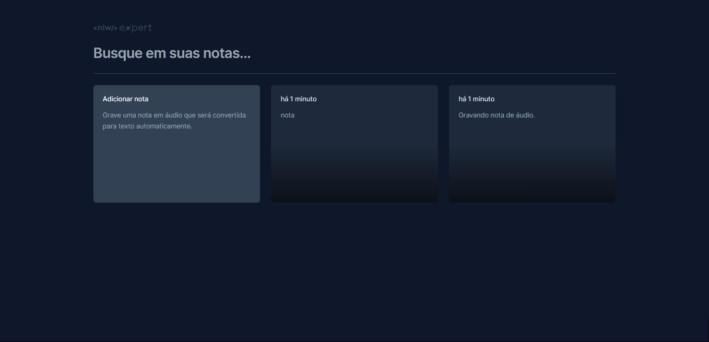

<p align="center">
  
</p>

<h1 align="center"> 
Notes
</h1>

<p align="center">
⚙️ Desenvolvimento de um aplicativo de notas de audio que se convertem em texto. ⚙️
</p>

<br>

<p align="center">
  
</p>

<br>

## 🛠 Tecnologias

Esse projeto foi desenvolvido com as seguintes tecnologias:

- **[React](https://react.dev/reference/react)**
- **[TypeScript](https://www.typescriptlang.org/docs/handbook/typescript-in-5-minutes.html)**
- **[Tailwind](https://tailwindcss.com/docs/installation/framework-guides)**
- **[SpeechRecognition API](https://developer.mozilla.org/en-US/docs/Web/API/SpeechRecognition)**
- **[Figma](https://www.figma.com/dev-mode/)**

<br>

## Executando

Após clonar o repositório, acesse a pasta do projeto e execute os comandos abaixo:

```sh
npm install
npm run dev
```

Acesse http://localhost:5173 para visualizar a aplicação.

<br>

## 🎨 Layout

Você pode visualizar o layout do projeto através [DESSE LINK](https://www.figma.com/community/file/1336456128647909148). É necessário ter conta no [Figma](https://figma.com) para acessá-lo.

<br>

## 📝 License

<p align="center">
  
</p>
<p align="center">Esse projeto está sob a licença MIT.</p>

<br>

### 👨‍💻 Autor

 
 <em>Ciro Batista da Silva<em>
 
 <br/>

 <p>👋🏽 Entre em contato!</p>

[](https://twitter.com/CiroSilva2020) [](https://www.linkedin.com/in/ciro-batista-da-silva-8b6838205/)
[](mailto:cirofight@gmail.com)
